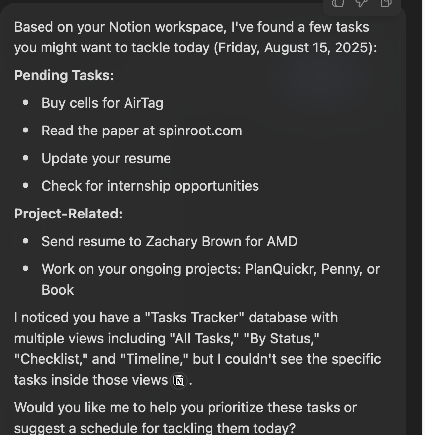
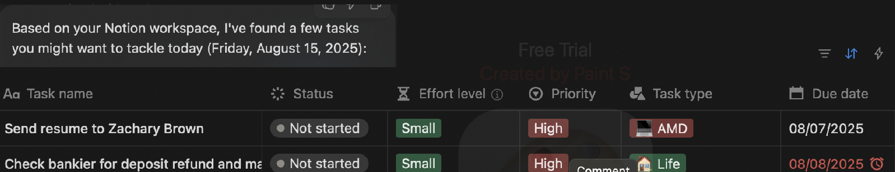

# intent2view
Chatting with LLMs is highly inefficient, and integration into existing tools is horrible.

I want to build out a list of tools that help LLMs communicate effectively using the right UI. 

### Why

Humans understand better in abstract terms focused on very specific activities. Chat is slow and ambiguous. Tools already have rich templates (tables, boards, timelines), but today's AI mostly returns text or ad-hoc bullets. We want AI to pick and render the right UI, not narrate it.

### Example

Ask: “What should I tackle today?”\
Bad: generic bullets.\
Good (auto-view): a checklist grouped by Priority, showing Effort chips, and Due date with overdue in red. You instantly see what matters.

An example below from my personal notion

Should ideally give me 

Notice the difference, I instantly know the priorities, effort required and the red date springs me to action.

No random AI driven bullet points which convey no information.

# How ?

I intent to figure that out in this repository!

This could be 
- an AI html page that generates UI components / apps as it goes for you to interact with it.
- Uses pre built UI to commmunicate and control data. 
- An interface to bring up and control apps (an AI Operating System)

# Existing Solutions

List of existing solutions and their analyses

- https://www.typeleap.com

# Intent-Mapping

Here are some intent mappings I am thinking of

| Intent        | Mapping   |
|   -           |   -       |
| Signal Data   | Waveform Viewer with decoded data (State names, enums, etc.) instead of raw signal (1, 0, hexes) |
|   -           |   -       |  
